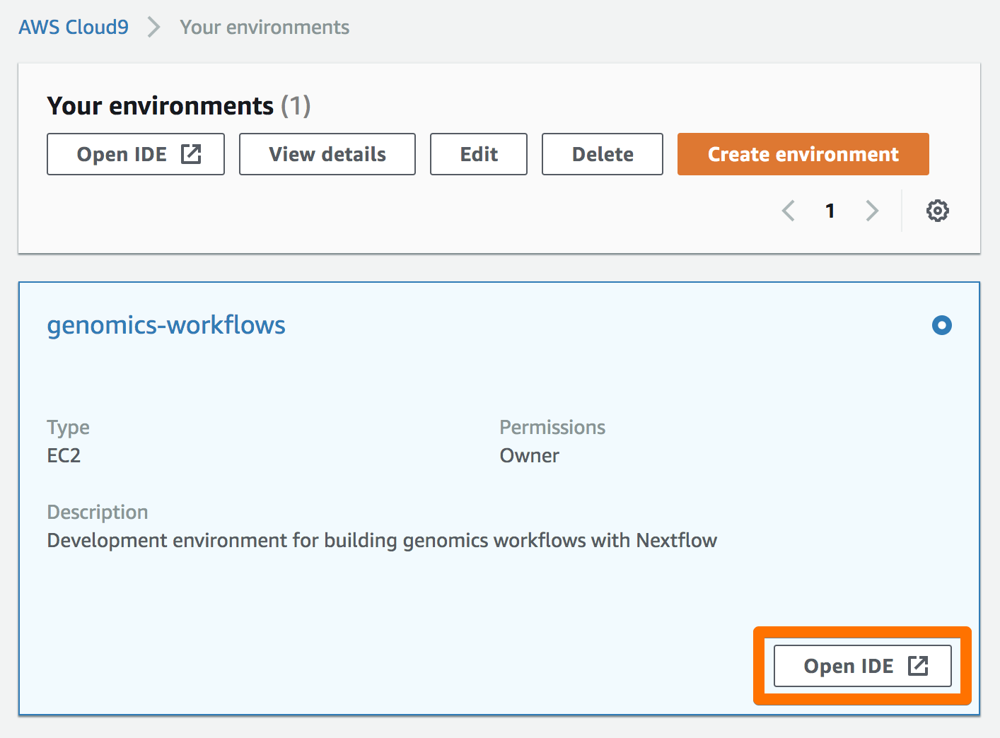
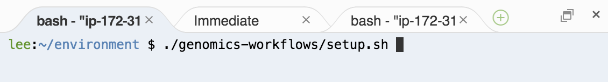

# Genomics Workflows on AWS Demos

Materials for demonstrating running genomics workflows on AWS.

## Setup

These demos are intended to be run from a Cloud9 environment.

### Create a Cloud9 IDE

Use the included CloudFormation template to create a Cloud9 stack:
[](./cfn/cloud9.cfn.yaml)

```bash
aws --profile demos cloudformation create-stack \
    --stack-name genomics-cloud9 \
    --template-body file://cfn/cloud9.cfn.yaml \
    --parameters \
        ParameterKey=EnvironmentOwnerIAMType,ParameterValue=user \
        ParameterKey=EnvironmentOwnerIAMName,ParameterValue=<IAM_USER_NAME>
```

Once the stack launch has completed, go to the Amazon Cloud9 Console and open the `genomics-workflows` IDE:



### Install Dependencies

In a terminal within the Cloud9 IDE, run:

```bash
./genomics-workflows/setup.sh
```



